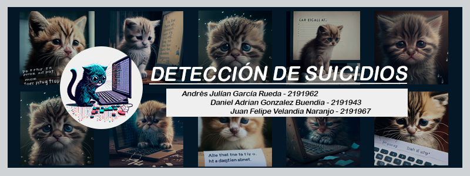

# Deteccion de Suicidios

**Autores**: 
Daniel Adrian Gonzalez Buendia, Andres Julian Garcia Rueda, Juan Felipe Velandia Naranjo

**Objetivo**: 
Haciendo uso de metodos de Machine Learning, buscamos en base al analisis de publicaciones en redes sociales realizadas por una persona, detectar si tiene tendencias suicidas.

**Dataset**: 
*Link de descarga*: https://www.kaggle.com/datasets/nikhileswarkomati/suicide-watch 
El dataset es una coleccion de publicaciones originarias de la plataforma Reddit. 
Las publicaciones fueron tomadas del 2008 hasta el 2021 atraves del uso de la API Pushshift.

**Modelos**: 
GaussianNaiveBayes, DecisionTreeClassifier, RandomForestClassifier, SupportVectorMachine, NeuralNetwork

**Código**: https://colab.research.google.com/drive/19p2n8rOOp6vAgfnPygq9wnuFAX3Q5Hhv?usp=share_link 
**Video**: https://youtu.be/sthPgAHREcQ 
**Repositorio**: https://github.com/FelipeVelandia/Proyecto-IA 
